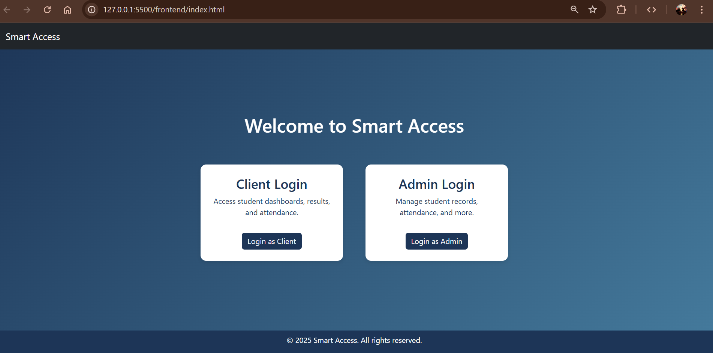

# 🎓 Smart Student Management System

A full-stack web application designed to manage student records, attendance, and results with secure admin and student login. Built using **Flask (Python)**, **MongoDB**, **HTML/CSS/JS**, and **Bootstrap**.



---

## 🌟 Features

### 👨‍💼 Admin Panel
- 🔐 Secure login using JWT
- ➕ Add new students
- 🧾 Add results (marks)
- 📅 Mark and view attendance
- 📈 View attendance summaries (with alerts for <75%)
- ⚙️ Update admin settings
- 📊 Interactive charts using Chart.js

### 👨‍🎓 Student Portal
- 📝 Set and manage password (only if pre-added by admin)
- 📌 View grades and attendance
- 📅 See next class details
- 📚 Quick links to timetable, notes, and feedback

---

## 🚀 Tech Stack

| Frontend       | Backend      | Database  | Tools         |
|----------------|--------------|-----------|---------------|
| HTML5 / CSS3   | Python (Flask) | MongoDB   | Postman       |
| JavaScript     | Flask-RESTful | JWT Auth  | VS Code       |
| Bootstrap 5    | CORS + JWT    |           | Git/GitHub    |

---

## 🔐 Authentication Flow

1. Admin creates student records (email must be pre-registered).
2. Student sets password using email through `/set-password` endpoint.
3. Login protected with JWT.
4. Admin and student have separate dashboards and permissions.

---

## 🧠 Learning Outcomes

- Implemented REST APIs and connected them to frontend using `fetch()`.
- Applied **JWT authentication** for secure routing.
- Used **MongoDB aggregation** for attendance summary.
- Managed **CORS policies** for frontend-backend communication.
- Built responsive UI using **Bootstrap** and **Chart.js**.

---

## 📁 Project Structure

student_management_system/
│
├── backend/
│ ├── app_main.py
│ ├── routes/
│ ├── models/
│ └── utils/
│
├── frontend/
│ ├── admin/
│ ├── client/
│ ├── script/
│ └── css/


---

## ⚙️ Setup Instructions

```bash
# Clone the repo
git clone[https://github.com/Dsp2810/Micro_IT_student-management-system].git
cd Micro_IT_student-management-system/backend

# Create virtual environment and activate
python -m venv venv
venv\Scripts\activate

# Install dependencies
pip install -r requirements.txt

# Run the Flask app
python app_main.py

✍️ Developed By
Dhaval S Patel
📫 dspatel0006@gmail.com

📌 License
This project is licensed under the MIT License.


> ✅ You can customize the screenshot URLs, your name, and the email link as needed.  
> 🔁 Let me know if you'd like a **dark theme** or **banner image** included too!
